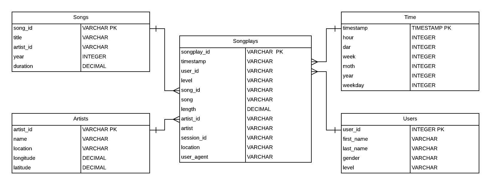

    
# SparkifyDB

## Project Purpose
This purpose of this project is to process song and songplay data into a dimensional data model that's optimized for analytical querying.

## Datasets
The song data comes from the One Million Songs dataset, while the songplay data is simulated. Both datasets are collections of JSON files.
The resulting data structure will be stored in a PostgreSQL database.

## Data Model
Records of business transactions or events, in this case music streams, are stored in the fact table `songplay`.
These can then be joined to the dimensional tables, `songs`, `artists`, `users`, and `time`, which provide contextual information of these events.

With this data model, the query writer can answer questions in simple SQL with a minimal number of joins.

    
## Scripts
The repository for this project consist of three Python scripts:

- `sql_queries.py` contains the SQL queries used to create and populate the database tables.

- `create_tables.py` contains the Python scripts that create the Postgres database and execute the table creation queries.

- `etl.py` contains the Python script that processes the JSON files and inserts them into the Postgres database.

## How to Use
To create the SparkifyDB database initially, run `python create_tables.py` in your console while in the project directory.

To execute the ETL script, run `python etl.py`.

The console will print a series of confirmation messages on successful insertion of records into the database.

To populate the dimensional tables, `etl.py` first checks if the values of the primary key column are unique.

If not, Python will not insert the records and the data must be cleansed.

The users table in particular is derived from Sparkify's log file. Since user attributes can change with time, the ETL script finds the
log file with the latest timestamp for each user, and populates the users table based on those records.

